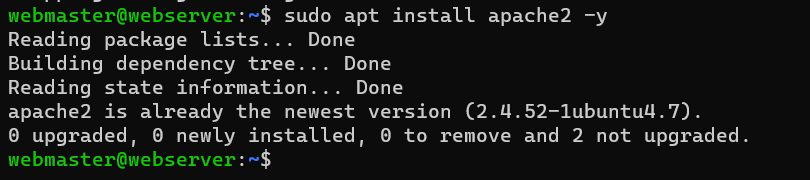

# Deliverable 2 Submission

## What are the server hardware specifications (virtual machine settings)?
 

## What is Ubuntu server log in screen?
 

## What is the IP address of your Ubuntu Server Virtual Machine?
 

## How do you enable the Ubuntu Firewall?
* You would enable the Ubuntu firewall by using the command `sudo ufw enable`
* Example:
 

## How do you check if the Ubuntu Firewall is running?
* Check by using the command `sudo ufw status`
* Example:
 

## How do you disable the Ubuntu Firewall?
* Disable by using the command `sudo ufw disable`
* Example:
 

## How do you add Apache to the Firewall?
* To add Apache, you will need to run the command `sudo ufw allow 'Apache'`
* Example:
 

## What is the command you used to install Apache?
* To install Apache, use the command `sudo apt install apache2 -y`
* Example:
 

## What is the command you use to check if Apache is running?
* To check if Apache is running use `systemctl status apache2 --no-pager`
* Example:
 

## What is the command you use to stop Apache?
* To stop Apache run this command `sudo systemctl stop apache2`
* Example:
 

## What is the command you use to restart Apache?
* To restart Apache use `sudo systemctl restart apache2`
* Example:
 

## What is the command used to test Apache configuration?
* To test Apache configuration, use `sudo apachectl -t`
* Example:
 

## What is the command used to check the installed version of Apache? 
* To check installed version of Apache, use `sudo apache2 -v`
* Example:
 

## What are the most common commands to troubleshoot Apache errors?
* systemctl - Used to control and interact with Linux services via the systemd service manager.
* journalctl - Used to query and view the logs that are generated by systemd.
* apachectl - When troubleshooting, this command is used to check Apache’s configuration.

## Which are Apache Log Files, and what are they used for? 
* Apache log files are a very helpful resource for troubleshooting. 
* Normally, any error that you receive in a browser or other HTTP client will have a corresponding entry in Apache’s logs.
* Example:
 