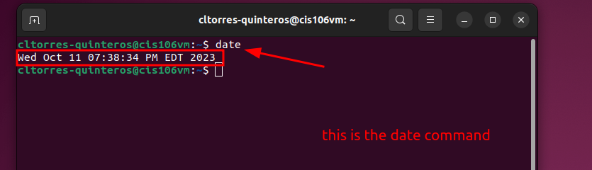
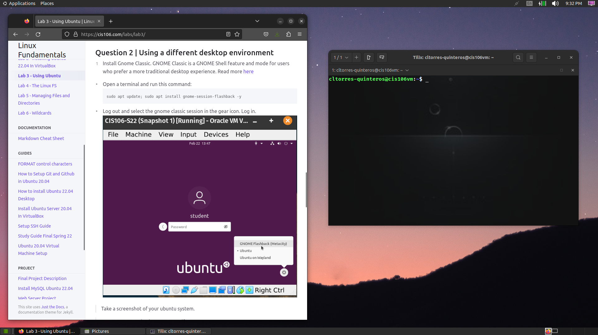

# Lab 3 Submission

## Question 1

## Question 2

## Question 3
| Program purpose     | Package Name | Version            |
| ------------------- | ------------ | ------------------ |
| Play a tetris game  | blockattack  | 2.7.0-1            |
| Play a video file   | dragonplayer | 4:21.12.3-0ubuntu1 |
| Browse the internet | falkon       | 3.2.0+dfsg1-1      |
| Read your email     | gnome-gmail  | 2.9-3              |
| Play music          | knowthelist  | 2.3.1-1build1      |

## Question 4
| Command | What it does                                                                                      |
| ------- | ------------------------------------------------------------------------------------------------- |
| echo    | Displays a line of text and echo strings to standard outputs.                                     |
| fortune | Prints a random but hopefully interesting truth.                                                  |
| cowsay  | Configurable speaking/thinking cow using text provided by users.                                  |
| lolcat  | Rainbow coloring effect for text console display using a cat.                                     |
| figlet  | Display large characters made up of ordinary screen characters.                                   |
| toilet  | Display large colorful characters.                                                                |
| rig     | Random Identity Generator that randomly chooses a first name, last name, and an accurate address. |
