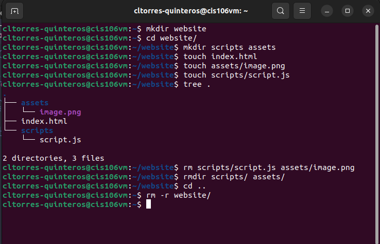
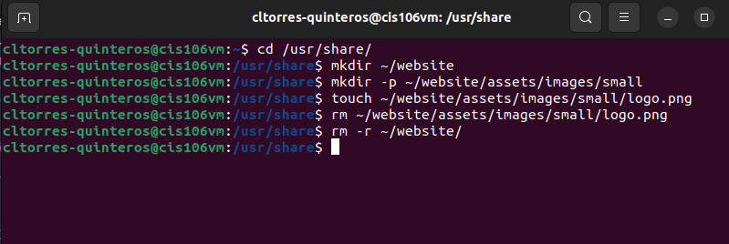
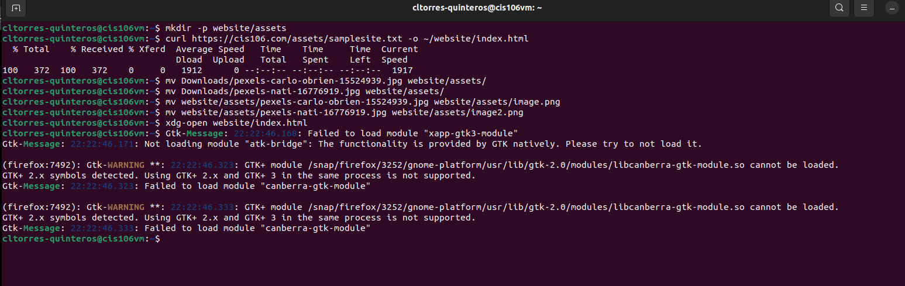
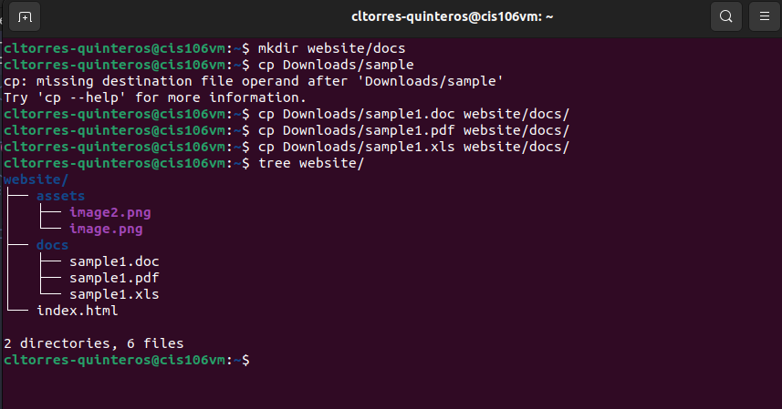

# Week Report 5

## Answer to Questions:

* **What are Command Options?**
Command options are commands that modify or enhance their behavior.
* **What are Command Arguments?**
Command arguments are the items that the command acts on which can be a file or a directory.
* **Which command is used for creating directories? Provide at least 3 examples.**
The command that is used for creating directories is the mkdir command.
* Example 1: create a directory in the present working directory.
  * 'mkdir burrito'
* Example 2: create a directory in a different directory using absolute path.
  * 'mkdir burrito/chicken'
* Example 3: create multiple directories
  * 'mkdir burrito/steak burrito/bean burrito/beef'
* **What does the touch command do? Provide at least 3 examples.**
The touch command is used for creating files.
* Example 1: create a file called room.
  * 'touch room'
* Example 2: create several files
  * 'touch bedroom.txt living_room.txt dining_room.txt'
* Example 3: create a file using absolute path.
  * '~/Documents/bedroom.txt'
* **How do you remove a file? Provide an example.**
To remove a file, you have to use the rm command.
* Example: remove a file.
  * 'rm red'
* **How do you remove a directory and can you remove non-empty directories in Linux? Provide an example**
You remove a directory by using the rm -r command. To remove non-empty directories in Linux, you use rm -r and the directory name or directory absolute path.
* Example: remove a non-empty directory.
  * 'rm -r Downloads/games'
* **Explain the mv and cp command. Provide at least 2 examples of each**
The mv command moves and renames directories.
* Example 1: move a file from one directory to another using relative path.
  * 'mv Downloads/red.pdf Documents/'
* Example 2: rename a file.
  * 'mv green.docx brown.docx'
The cp command copies files or directories from a source to a destination.
* Example 1: copy a file
  * 'cp Downloads/mydog.pdf Documents/'
* Example 2: copy a directory with absolute path.
  * 'cp -r ~/Downloads/themes ~/Pictures/'

## Practice 1
 

## Practice 2
 

## Practice 3
 
 
 

## Practice 4
 