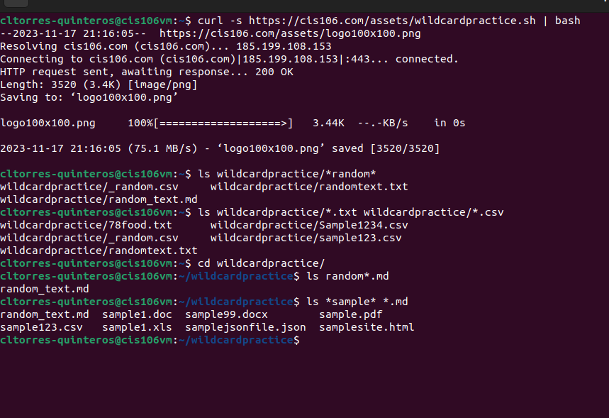
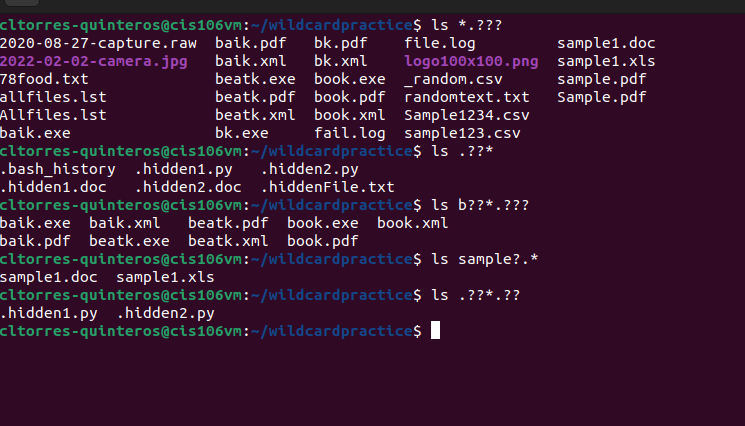
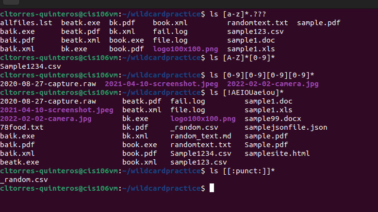

# Week Report 6

## Wildcards
* Wildcards represents letters and characters that are used to specify a file name for searches.

### * Wildcard
* The * or star wildcard matches anything and nothing but it also matches any number of characters.
* Examples:
  * List all files in a directory that end in .txt
    * `ls *.txt`
  * List all the files that end in .txt or .pdf
    * `ls *.txt *.pdf`
  * List all the files that start with the word file
    * `ls file*`

### ? Wildcard
* The ? wildcard matches only one character.
* Examples:
  * List all the files that have two characters between letter b and k.
    * `ls b??k*`
  * List all the files that have a single character between letter f and l.
    * `ls f?l*`
  * List all files that have a 3 letter file extension.
    * `ls *.???`

### [ ] Wildcard
* The brackets wildcard match a single character in a range.
* Examples: 
  * To match all files that have a vowel after f.
    * `ls f[aeiou]*`
  * To match all files that do not have a vowel after letter f.
    * `ls f[!aeiou]`
  * To match all files that have a range of letters after f.
    * `ls f[a-z]*`

### Brace Expansion
Brace expansion is not a wildcard but another feature of bash that allows you to generate arbitrary strings to use with commands.
* Example:
  * To create a whole directory structure in a single command.
    * `mkdir -p music/{jazz,rock}/{mp3files,videos,oggfiles}/new{1..3}`
  * To create a N number of files.
    * `touch website{1..5}.html`
  * Remove multiple files in a single directory.
    * `rm -r {dir1,dir2,dir3,file.txt,file.py}`

## Let's Practice

### Practice 5
 

### Practice 6
 

### Practice 7
 