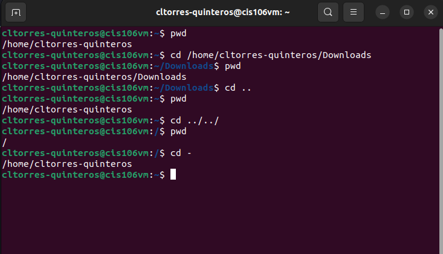
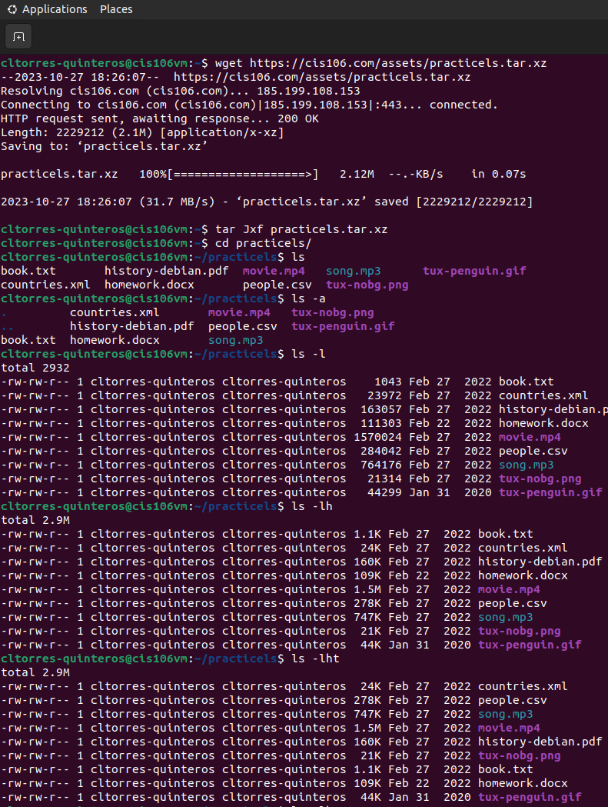
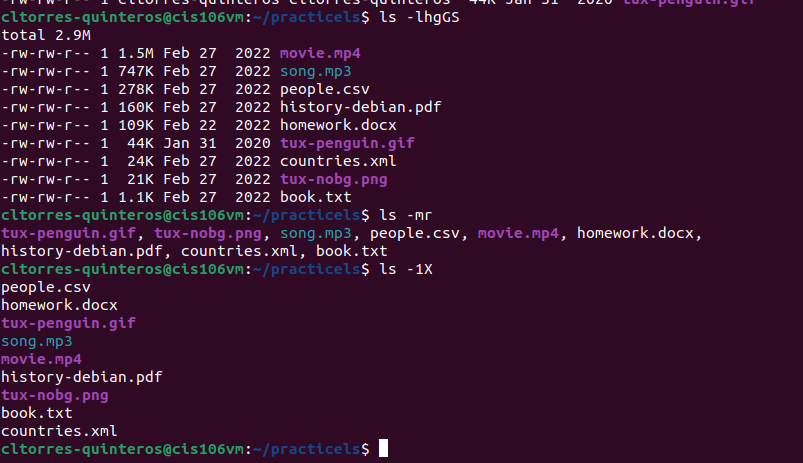
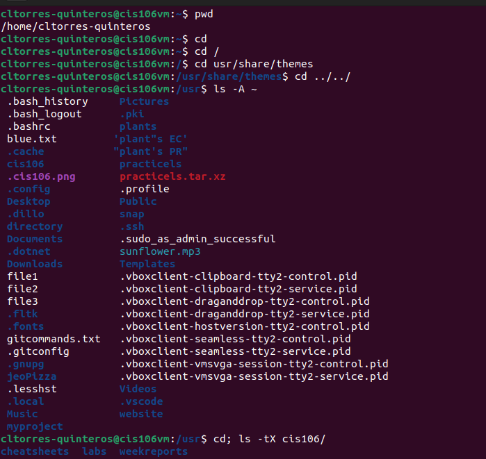
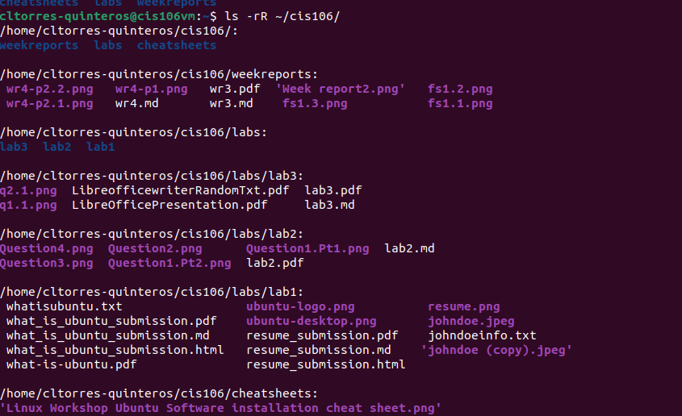
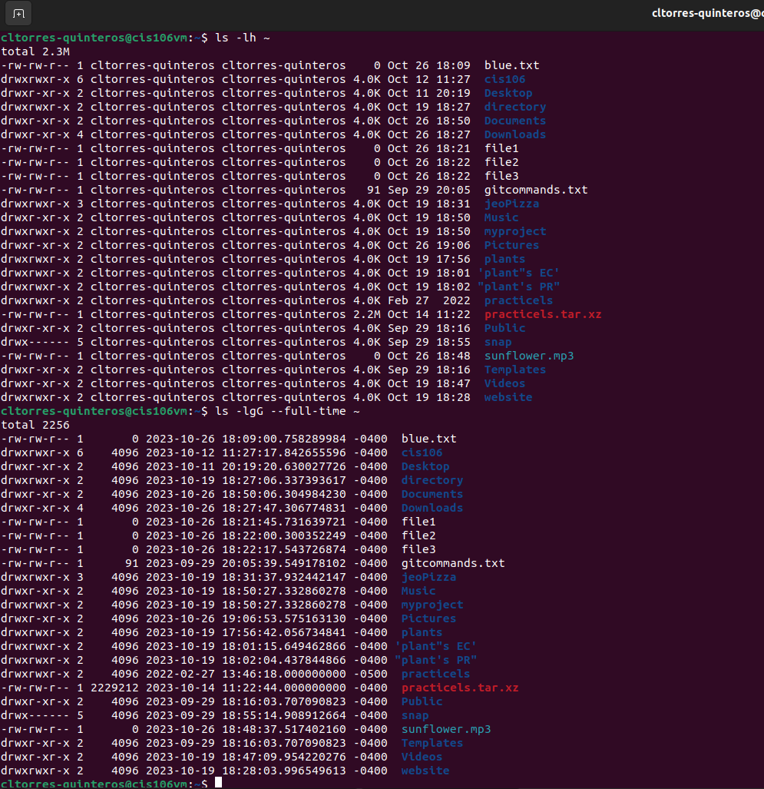
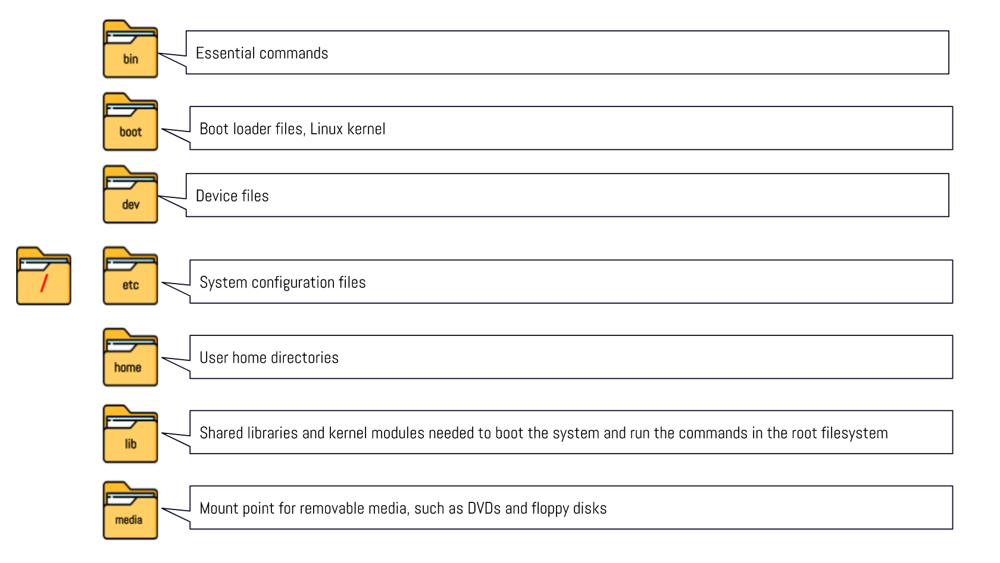
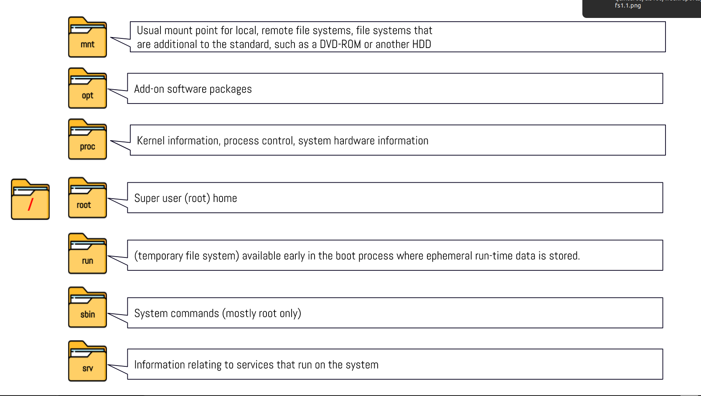
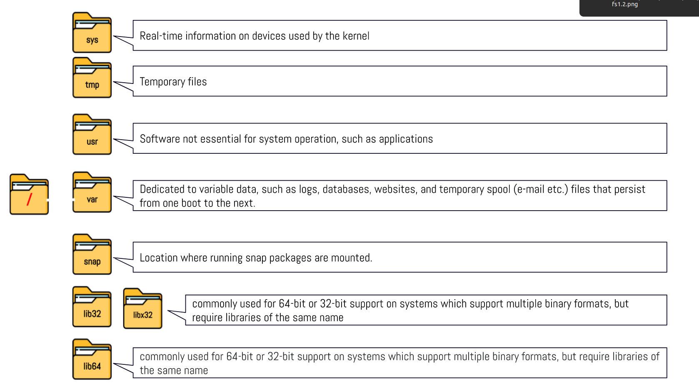

# Week Report 4

## Practice from the presentation The Linux File System:

### Practice 1
 
### Practice 2
 
 
### Practice 3
 
 
 
## The Linux File system directories and their purpose:

 
 
 

## All the commands for navigating the filesystem

| Command | What it does                      | Syntax               | Example    |
| ------- | --------------------------------- | -------------------- | ---------- |
| pwd     | prints current directory          | pwd                  | 'pwd'      |
| cd      | changes current working directory | cd + destination | cd $HOME        |
| ls      | lists content of given directory         | ls + option + directory to list   | 'ls -a ~/Pictures |

## Basic Terminology
* **File system-** the way files are stored and organized.
* **Current directory-** the directory where you are currently at.
* **Parent directory-** a subdirectory or previous directory. Where you are working inside.
* **The difference between your home directory and the home directory-** your home directory is your current working directory. The home directory is the starting folder.
* **Pathname-** indicates the location of a file in the file system.
* **Relative path-** the location of a file starting from the current working directory or a directory that is located inside the current working directory.
* **Absolute path-** the location of a file starting at the root of a file system.
